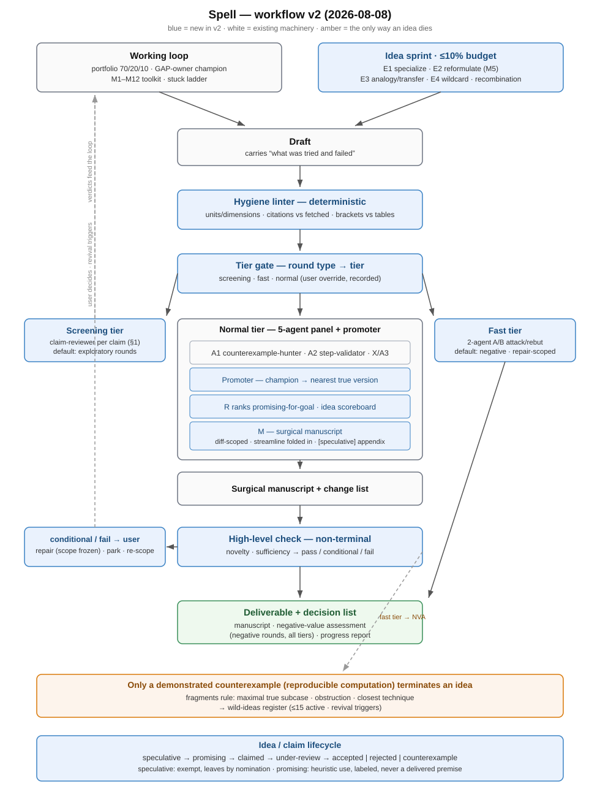

# Spell — Adversarial Multi-Agent Proof Protocol

> A rough idea in → a heavily-attacked manuscript out. Runs on any agentic
> system: Claude Code, Codex, Kimi Code, …

Spell is a **proof protocol, not a proof checker**: adversarial agents
attack your draft, attack each other's attacks, and rebut. The output is
reviewed prose — never a machine-checked proof. Be honest about what that
means: the reviewers are LLMs whose error-detection rate is not yet
calibrated, and novelty checking is the protocol's known weak point. A
Spell manuscript is *attacked*, not *verified*.

- **Adversarial by design** — every claim is attacked; every attack is
  attacked back.
- **Ideas survive opinion** — no verdict kills an idea: only a demonstrated
  counterexample is terminal; `fail`ed directions demote with revival
  triggers, every death deposits its fragments, and the wild-ideas register
  keeps ≤ 15 active ideas alive for revival. (Design guarantee — compliance
  is not yet audited.)
- **Portable** — roles, phases, and rules; no model or harness lock-in.
- **Three tiers per round** — screening (per-claim) · fast (2-agent A/B) ·
  normal (full 5-agent panel) — proposed from the round type, with your
  override.
- **Honest about cost** — personal experience: Kimi Code +
  Deepseek-v4-flash produced a manuscript draft in ~2 h for under $1. The
  protocol itself has not yet been benchmarked end-to-end on a real
  problem.

What you get: a process that attacks your ideas, drags gaps into the open,
and records every dead end — a stronger draft and a visible record of where
the argument stands. What you don't get: a certificate. The protocol is
designed and specified; its real-world performance is still unmeasured.

## What it is

A round opens with a bounded parallel **idea sprint**: 3–5 explorer agents
plus a recombination agent propose candidate attacks, each with the cheapest
discriminating test. A single agent then works on the problem and writes up
its results as a **draft**, which a deterministic **hygiene linter** passes
first — equations, citations, brackets, and constants checked mechanically
before any review. A **review panel** of adversarial agents attacks the
draft, attacks each other's attacks, and rebuts; a fresh-context **promoter**
runs alongside it, pushing the champion idea as far as it goes. A **ranking
agent** weighs the whole record; a separate **manuscript agent** writes the
**manuscript** from that ranking — surgically, patching only the sections the
record changed, the streamline step folded in. An independent **high-level
check** judges novelty and sufficiency; its routing is **non-terminal** —
`conditional` / `fail` demote the direction and attach revival triggers, and
you steer the next step. A negative round delivers an assessed rule-out — a
**negative-value assessment** — in place of a forced manuscript.
Only a manuscript that passes is delivered.

Every run ends with a deliverable (draft, manuscript, progress report, or
negative-value assessment) plus a decision list for you; the dossier carries
the state between runs, and you decide between them.

## How it works

**First round, normal tier** — the idea sprint proposes candidate attacks,
the 5-agent panel (A1, A2, X/A3, R, M, plus the promoter; phases A–F)
reviews the draft, and the high-level check routes non-terminally
(`pass` → deliver; `conditional` / `fail` → demote + revival triggers, and
you decide: repair / park / re-scope).



*Figure — the updated pipeline: idea sprint → hygiene linter → tier → panel + promoter → surgical manuscript → non-terminal check → deliverable; the wild-ideas register and the idea/claim lifecycle lane at the bottom.*

```
idea sprint ────────────────────────────────────────────┐
                                                        │
rough idea ────────────────► working loop ──► draft ────┼──► hygiene linter ─┐
manuscript (input) ─────────────────────────────────────┘                    │
                                                                             │
                                                                             ▼
                                                           tier: screening | fast | normal
                                                           (normal = 5-agent panel + promoter)
                                                                             │
                                                                             ▼
                                                           manuscript (surgical; streamline folded into M)
                                                                             │
                                                                             ▼
                                                           high-level check (non-terminal routing)
                                                                             │
                                                                             ▼
                                                           deliverable + decisions · negative rounds:
                                                           negative-value assessment (every tier)
                                                                             │
                                                                             ▼
                                                           you decide → next run
```

**Inside the review panel (normal tier)** — phases A–F, five agents, with
the promoter running alongside; all are spawned with the harness's explicit
background/async mode (`run_in_background=true` in Agent-tool harnesses,
never the blocking foreground default), and each phase
starts only when its written inputs exist.

```
draft / input manuscript
  │
  ▼
Phase A — independent review (three reviewers, in parallel)
  ├── A1 counterexample-hunter ──► review report
  ├── A2 step-validator ─────────► review report
  └── X (exterior) or A3 (architecture critic) ──► review report
  │
  ▼
Phase B — exchange: each reviewer reads the other two reports
  │
  ▼
Phase C — cross-review: each judges the other two ──► cross-judgements
  │
  ▼
Phase D — rebuttal: each answers the criticisms of its own report
  │
  ▼
Phase E — R (ranking agent): reads the full record — including the
          promoter's "nearest true version" note — ranks the ideas,
          closes the three reviewers
  │
  ▼
Phase F — M (manuscript agent): surgical manuscript + change list
          (patches only the sections the record changed; streamline folded in)
  │
  ▼
hygiene linter ──► high-level check (non-terminal routing)
  │
  ▼
deliverable + decisions · negative rounds: negative-value assessment (every tier)
```

The **promoter** — a fresh-context agent running alongside the panel — pushes
the champion idea as far as it goes: the strongest honest version, the
maximal true fragment, exactly where it breaks. Its "nearest true version"
note enters the record, and Phase E and Phase F read it.

- **Working loop** — persistence protocol: dossier, attempts log, a Pólya-style
  transformation toolkit (compute examples, specialize, reformulate, …), a
  stuck ladder with a minimum-output floor, anti-give-up rules. The author is
  a **planner**: it plans each session's work in advance, distributes it —
  massive or tedious tasks go to background sub-agents (mandatory, not
  optional) — and integrates the results before writing (every outcome
  traceable, conflicts reconciled; drafts stay high-level; manuscript
  sub-agents fix contradictions between agents). Each round opens with an **idea
  sprint** hard-capped at 30 minutes wall-clock: 3–5 explorer agents plus a
  recombination agent propose candidate attacks, each with a cheapest
  discriminating test where one exists (fields optional); all candidates —
  survivors and discards — enter the
  wild-ideas register with revival triggers, and survivors form the round's
  **sprint backlog** — the top of the attack queue, settled by the loop
  before free-form moves. A **manuscript input** skips
  this loop and the draft, entering the hygiene linter and the panel directly
  — shorter rounds. The input document is converted into `question.md` at
  round 1, and each round appends its subgoals to it.
- **Review panel** — 5 agents, phases A–F: three reviewers (A1
  counterexample-hunter, A2 step-validator, and X — an **exterior agent**
  from a different provider, or an internal A3 architecture-critic when you
  have no X), then ranking, then manuscript, with a fresh-context **promoter**
  running alongside the panel. All agents are spawned in the explicit
  background/async mode (`run_in_background=true` in Agent-tool harnesses,
  never the blocking foreground default); every
  manuscript version comes with a **change list** (what changed, why, and
  which changes are important). M writes **surgically** — only the sections
  the record changed, the streamline step folded in — and the **hygiene
  linter** passes before any review and again before delivery. The per-round
  **tier**, proposed from the round type at round start with your override,
  selects the pipeline weight: **screening** (per-claim claim-reviewer
  review; default for exploratory rounds) · **fast** (a 2-agent attack/rebut
  loop; default for negative and repair-scoped rounds, escalating to normal
  only for a load-bearing condition) · **normal** (the full panel plus the
  high-level check; required for load-bearing or manuscript-bound claims).
- **Verification** — every claim runs `speculative → promising → claimed →
  under-review → accepted | rejected | counterexample`. Every normal-tier
  panel carries a **canary gate** (a seeded known-false claim + one planted
  step-error must be caught — ≥80% / 100% with the step cited — or the
  manuscript is not delivered), and delivered `novel` claims are
  spot-checked after delivery. `speculative` ideas
  live in the wild-ideas register, exempt from the verification ledger and
  panel attack until nominated; `promising` claims may be built upon
  heuristically in exploration (every use labeled `heuristic use of <claim
  vN>`) but never appear as premises in delivered artifacts. No agent grades
  its own homework.
- **High-level check** — an independent gate on novelty and sufficiency
  before delivery (normal tier). Its routing is **non-terminal**:
  `conditional` / `fail` demote the direction and attach revival triggers;
  you steer the next step (repair / park / re-scope) — never an automatic
  continue. On negative rounds the deliverable is a **negative-value
  assessment** — an assessed rule-out, produced by a dedicated cheap agent
  in every tier — replacing the high-level check. It is independent review,
  never a certificate.

## Repository layout

```
Spell/
├── README.md              this file
├── LICENSE                MIT
├── .gitignore             credentials stay out of git
├── core.md                distilled rules — the only thing loaded per run
├── skills/spell/          the skill package — copy this folder to install
├── modules/               on-demand details
│   ├── toolkit.md             transformation toolkit M1–M12 + stuck ladder
│   ├── prompts.md             paste-ready prompts (reviewer · panel · ranking · manuscript · check · linter · sprint · promoter)
│   ├── dossier-template.md
│   └── providers.md           exterior agent variables + provider table
└── reference/             authoritative full rules (archive; read only to audit)
    ├── README.md · definition.md · review-panel.md
    ├── high-level-check.md · protocol.md · self-review.md
```

## Installing as a skill

Spell ships as a **self-contained skill package** in `skills/spell/`:
`SKILL.md` (the distilled core) plus the modules it references.
An installed skill costs **0 tokens until invoked**; invoking loads only the
core. All references inside the package are relative, so it is portable.

**User scope — all projects on this machine:**

```bash
mkdir -p ~/.kimi-code/skills
cp -r skills/spell ~/.kimi-code/skills/
```

Then invoke it in any session — e.g. ask your agent to "run Spell".

**Project scope — one repository** (the layout Kimi Code discovers under
`<project>/skills/`):

```bash
cp -r skills/spell <your-project>/skills/spell
```

**Verify:** start an agent session and ask for Spell's core; you should see
the distilled rules. If your CLI does not discover the folder, load
`core.md` manually — it is the same content.

**Package layout:**

```
skills/spell/
├── SKILL.md          frontmatter + distilled core (the only thing loaded)
└── modules/          on-demand: toolkit · prompts · dossier-template · providers
```

## Starting a project

1. Load `core.md` (or invoke the `spell` skill).
2. The **very first startup question** is a choice: set up the exterior
   reviewer X — `X_PROVIDER`, `X_MODEL`, `X_ACCESS` (a provider API key or
   the local Codex CLI) — or declare no X (the panel then runs internal A1 +
   A2 + A3 with explicit roles). Then the output form (PDF / LaTeX /
   Markdown / HTML), then the round count (`ROUNDS`, 1–10 — recommended
   ≤ 10: the accumulated record can exceed the context window beyond that).
3. Create the dossier from `modules/dossier-template.md`: lock the problem
   statement and notation, open the first thread. Convert the input document
   (any format — `.tex`, `.md`, `.pdf`, …) into `question.md`, the canonical
   statement.
4. Input the rough idea or the manuscript. A manuscript input skips the
   working loop and the draft, entering the hygiene linter and the panel
   directly; from then on: draft → hygiene linter → tier → surgical
   manuscript → high-level check → deliverable + decision list (normal tier;
   fast and screening rounds skip the high-level check; negative rounds
   deliver a negative-value assessment).
5. Every round starts with the **tier**: the orchestrator proposes one from
   the round type — **screening** (per-claim claim-reviewer review; default
   for exploratory rounds), **fast** (a 2-agent A/B attack/rebut loop; default
   for negative and repair-scoped rounds), or **normal** (the 5-agent panel,
   phases A–F; required for load-bearing or manuscript-bound claims) — and
   you may override. The choice is recorded in the dossier and binds the
   whole round.

## Design principles

- **Adversariality is a feature.** Every claim is attacked; every attack is
  itself attacked and rebutted.
- **Independence is structural.** Reviewers never see the author's reasoning,
  each runs in a fresh context, and one reviewer comes from a different
  company's model entirely.
- **Runs are bounded; the user decides.** At most `RUN_LENGTH` of agent work
  per run (chosen at project start) — every run ends with a deliverable and a
  decision list for you. At round 1 you choose how many rounds to run
  (`ROUNDS`, 1–10; recommended ≤ 10 to stay inside the context window); each
  round records its start time, closes with a single atomic **round-close**
  record (timing, subgoals, decisions, and ledger rows in one pass), and
  reports its elapsed time at the end.
- **Recording is mandatory.** Progress is measured in dossier entries, not
  solutions; dead ends and rejections are data.
- **Everything is versioned.** Every draft, report, manuscript, change list,
  and ranking carries a version (`v1`, `v2`, …), and so does every update to
  the problem statement; nothing is cited without its version. Once an
  artifact kind has more than 2 versions, it moves into its own folder
  (`research/drafts/` · `research/manuscripts/` · `research/reports/` ·
  `research/changelogs/`).
- **Portable to any agentic system.** Spell is roles, phases, and rules — not
  a model or a harness — so it layers onto any agentic system and is easy to
  personalize: swap prompts, add tools, change phases, or reuse the
  discipline elsewhere.
- **Nothing is a certificate.** Panel verdicts and high-level checks are
  independent review, not formal proof.
- **Nothing delivered rests on a non-accepted premise.** Ideas are free to
  develop, but the delivery gate is fixed: no delivered artifact builds on
  an unaccepted premise.
- **Opinions rank; only demonstrated counterexamples kill.** "Known",
  "beyond reach", "misdirected" are opinions — they demote and attach revival
  triggers, never terminate. The only terminal state for an idea is a
  demonstrated counterexample with a reproducible computation (you may always
  park a thread yourself; the no-kill rule binds the protocol, not you).
- **Deterministic checks beat model checks for mechanical error classes.**
  Units, citations, brackets, and numerical exact-case reproductions are
  linter/script territory, not reviewer territory.
- **Round type selects pipeline weight.** Screening, negative, repair, and
  manuscript-bound rounds do not all run the 5-agent panel; the tier is
  proposed from the round type at round start, with your override.
- **The loop converges monotonically.** Artifact size non-growing, open
  condition count non-increasing, per-claim verification depth non-decreasing
  — any violation is a protocol alarm.
- **The user steers at verdicts.** `conditional` / `fail` / negative-outcome
  routing is a user decision (repair / park / re-scope), never an automatic
  continue.
- **Ground truth is un-overturnable.** A formalized lemma (Lean 4) is the
  only check the next round's gate cannot overturn; load-bearing claims
  should be anchored to it where feasible.
- **Budget is conserved.** The savings from tier selection fund the new
  phases — the idea sprint, hygiene linter, promoter, and negative-value
  assessment — and the total per-round agent budget does not grow.

## Provenance

The protocol synthesizes two research-protocol ideas — the *Persistence
Protocol* (never give up, record everything) and the *Independent
Verification Protocol* (no agent grades its own homework) — adapted to a
multi-agent pipeline. `reference/self-review.md` records a two-agent critical
review of the design and the decisions taken since, including the 2026-08-08
architecture-update plan and its implementation (addendum §8).
